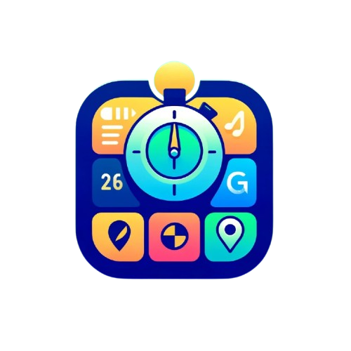

# MultiApp Project

Ini merupakan project Teknologi Mobile Teori Informatika 2024/2025 kelas IF-E dengan developer  :

- [Erlyta Rachma A.  (123220008)](https://github.com/alnzzz17)
- [Salma Hanifa      (123220019)](https://github.com/salmahnf)
- [Diandra Yusuf A.  (123220031)](https://github.com/haloYusuf)

# Penjelasan Aplikasi

  

MultiApp merupakan sebuah project kuliah yang menerapkan Session, LBS, dan masih banyak fitur lainnya. Di aplikasi ini, fitur yang tersedia antara lain :
- Login
- Stopwatch
- LBS Tracker
- Time Conversion
- Site Recommendations
- List Site Favorite
- List Developer Team
- About This App

Untuk mencoba aplikasi bisa akses [di sini.](https://drive.google.com/file/d/1QN3iPpcYxyEfQ0NCF15cacfWPDFNqBZm/view)
